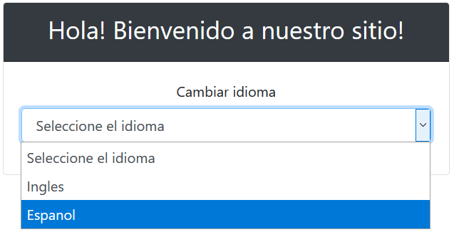
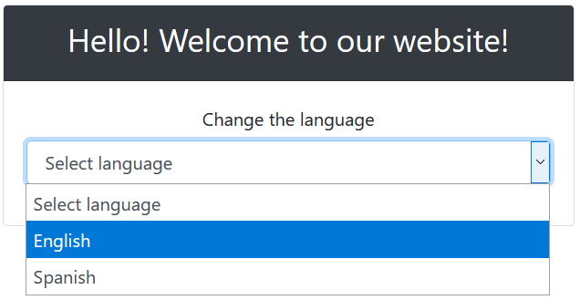

# SpringInternationalization

Example of Internationalization in Spring Boot

Main dependencies:

  	   <dependencies>
   		<dependency>
			<groupId>org.webjars</groupId>
			<artifactId>webjars-locator-core</artifactId>
		</dependency>
		<dependency>
			<groupId>org.webjars</groupId>
			<artifactId>bootstrap</artifactId>
			<version>4.0.0</version>
		</dependency>
		<dependency>
			<groupId>org.webjars</groupId>
			<artifactId>jquery</artifactId>
			<version>3.1.1-1</version>
		</dependency>
      <dependency>
         <groupId>org.springframework.boot</groupId>
         <artifactId>spring-boot-starter-web</artifactId>
      </dependency>

      <dependency>
         <groupId>org.springframework.boot</groupId>
         <artifactId>spring-boot-starter-test</artifactId>
         <scope>test</scope>
      </dependency>

      <dependency>
         <groupId>org.springframework.boot</groupId>
         <artifactId>spring-boot-starter-thymeleaf</artifactId>
      </dependency>
   </dependencies>
   
Creating the Internationalization configuration class:

	@Configuration
	public class Internationalization implements WebMvcConfigurer {

		@Override
		public void addInterceptors(InterceptorRegistry registry) {
			registry.addInterceptor(localeChangeInterceptor());
		}
		@Bean
		public SessionLocaleResolver localeResolver() {
			SessionLocaleResolver slr = new SessionLocaleResolver();
			slr.setDefaultLocale(Locale.US);
			return slr;
		}
		   @Bean
		   public LocaleChangeInterceptor localeChangeInterceptor() {
			  LocaleChangeInterceptor localeChangeInterceptor = new LocaleChangeInterceptor();
			  localeChangeInterceptor.setParamName("language");
			  return localeChangeInterceptor;
		   }
		
	}

Creating controller class:

			@Controller
			public class MainController {

				
				@RequestMapping("/")
				public String home() {		
					return "index";
				}
			}

Creating home page:

		<!DOCTYPE HTML>
		<html xmlns:th="https://www.thymeleaf.org">
		<head>
			<title>Public Library</title>
			<meta http-equiv="Content-Type" content="text/html; charset=UTF-8" />
			<link href="/webjars/bootstrap/css/bootstrap.min.css" rel="stylesheet">
			
			 
		</head>
		<body>
			

				

				  

					<h3 th:text="#{greeting}"></h3>
				  

				  

					

						<label for="exampleFormControlSelect1" th:text="#{lang.change}"></label>
							<select class="form-control" id="locales">
								<option value="" th:text="#{select.lang}"></option>
								<option value="en" th:text="#{lang.eng}"></option>
								<option value="es" th:text="#{lang.es}"></option>
							</select>
					  

				  

				

			

		
		</body>
		</html>
